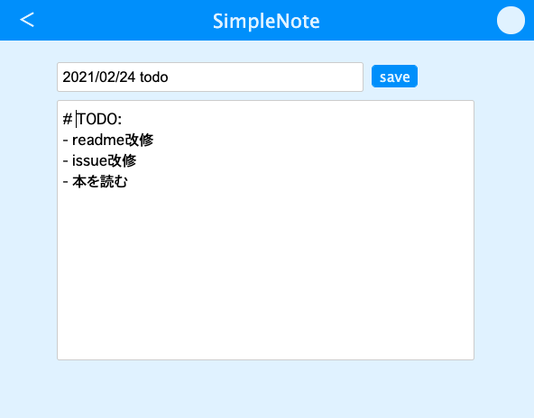

# simple note app

## overview

Client(React) + Backend(Go) + DB(MySQL)で作成したサンプルアプリ。
簡易的なノートの管理が可能。




## feature

- ユーザ認証
- ノートのCRUD
- ユーザ管理

## how to start

```
// db立ち上げ
$ docker-compose up -d

// サーバの立ち上げ
$ cd go
$ go run cmd/main.go

// クライアント
$ cd client
$ npm install
$ npm start
```